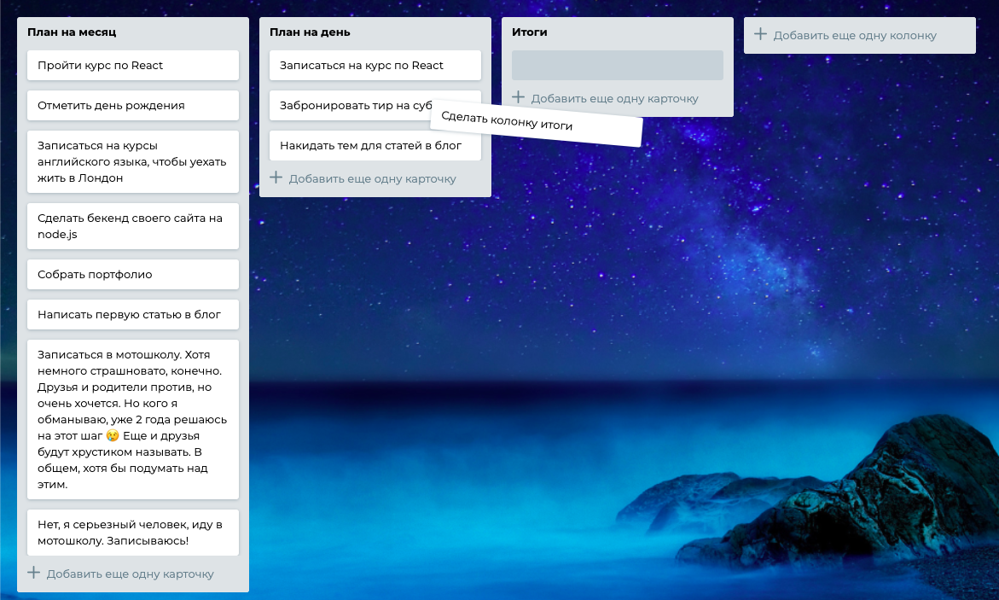

# VK Internship Test Task

Check it out here [https://terdenan.github.io/naive-trello/](https://terdenan.github.io/naive-trello/)

Run project: 
```
$ npx serve
```
It's necessary to start app using this command, otherwise JavaScript imports won't work.

